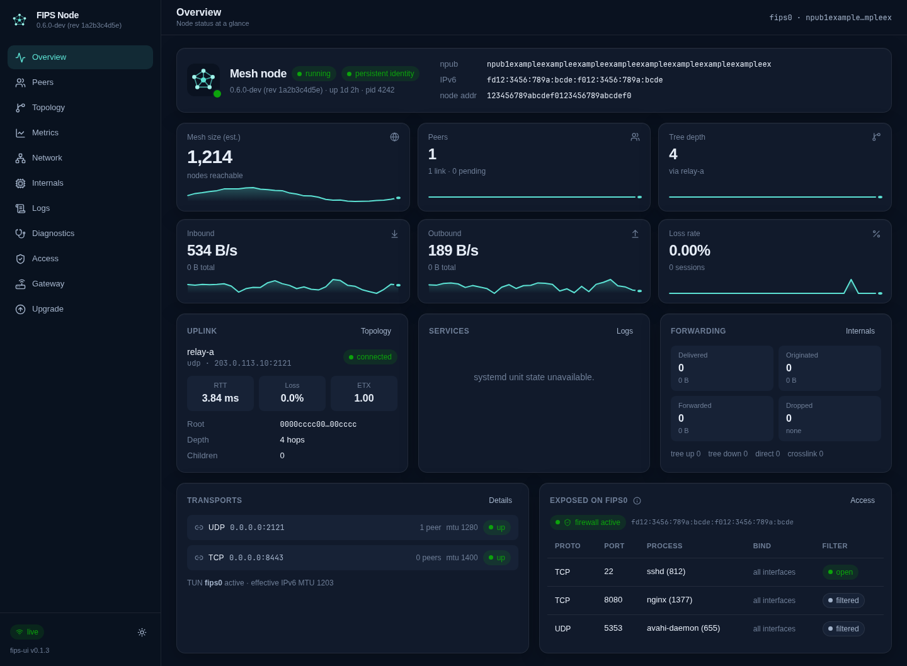

# FIPS UI

A modern web dashboard to **watch and manage a [FIPS](https://github.com/jmcorgan/fips) mesh node**.
It talks to the daemon's control socket directly, streams live state to the browser over
Server-Sent Events, follows the daemon's journal, and can connect/disconnect peers, run
reachability probes, and (optionally) upgrade the node.



## Features

| Page | What you get |
| ---- | ------------ |
| **Overview** | Identity (npub, IPv6, node address), role in the tree, mesh-size / peers / depth / traffic / loss tiles with sparklines, uplink quality, systemd unit health, forwarding counters, transports, and which local services are exposed on `fips0` and how the fips firewall treats them. |
| **Peers** | Sortable, filterable table of authenticated peers with role, RTT, loss, ETX, goodput and traffic. Click a peer for a detail panel with 10-minute RTT / loss / throughput charts, tree coordinates, Noise counters. **Connect** (npub or hostname, address, transport) and **Disconnect** with confirmation. |
| **Topology** | The spanning tree drawn from the root down through the ancestry to this node and its children, with crosslink peers on the side. Coordinates, tree state and protocol counters. |
| **Metrics** | Time series from the daemon's history rings: every node-level metric, one metric compared across peers, or all metrics for one peer. 10 min / 1 h at 1 s resolution, 6 h / 24 h at 1 min. |
| **Network** | Transports (with interface presence for interface-bound ones), links per transport, end-to-end sessions, native datagram flows and listeners. |
| **Internals** | Every protocol counter family (searchable), routing state (pending lookups, retries, congestion), Bloom filters with fill meters, coordinate and identity caches. |
| **Logs** | Live `journalctl -u fips` with level filter, search, pause, and target highlighting. |
| **Diagnostics** | Staged reachability probes (bloom → discovery → path → session → RTT) against any npub or hosts-file name, with path visualisation and a run history. |
| **Access** | **Web UI over the mesh**: let other FIPS nodes open this dashboard, authorised by npub with viewer or admin roles and no password, because the mesh authenticates every connection's source address ([docs/mesh-access.md](docs/mesh-access.md)). Also peer ACL state, firewall exposure of local listeners, identity file facts, and an editor for the FIPS **hosts file**: names for npubs, resolved as `<name>.fips` and shown next to npubs everywhere in the UI, optionally synced from a master node over the mesh ([docs/hosts-sync.md](docs/hosts-sync.md)). |
| **Gateway** | `fips-gateway` pool utilisation and mappings when the gateway socket is present. |
| **Configuration** | Edit `/etc/fips/fips.yaml` with live YAML validation, a diff of your changes and backups. Secrets stay redacted and are restored on save; applying restarts the daemon and rolls back automatically if it does not stay up. See [docs/node-management.md](docs/node-management.md). |
| **Firewall** | Enable, start, stop and reload `fips-firewall`, see drop counters, add inbound rules for specific npubs, hosts-file names, prefixes or anyone, one-click "allow" for a filtered listener, and raw editing of other drop-ins. Every change is validated with `nft -c` before it is written. |
| **Upgrade** | Install the latest GitHub release (checksum-verified) or build any ref from source with cargo, with backups and rollback. Root steps go through a tiny helper you install once from a shell. See [docs/upgrade.md](docs/upgrade.md). |

Dark and light themes, responsive down to phone width, no external fonts or CDNs.

## Requirements

- Node.js 22.18+, 23.6+ or 24+ (the backend is TypeScript run directly by Node's unflagged type stripping; no build step for the server)
- A running `fips` daemon; the UI user must be in the **`fips`** group to reach `/run/fips/control.sock`
- `journalctl` access to the fips unit for the Logs page (membership in `systemd-journal`, or `adm` on Debian, or being the same user that runs the daemon)

## Operating systems

The dashboard reads the daemon through its control socket and asks the local service manager and log system
for everything else, so the read-only pages work wherever FIPS runs:

| | Control endpoint | Service state and actions | Logs page |
|---|---|---|---|
| Linux, systemd | `/run/fips/control.sock` | systemctl | journald |
| Linux, OpenRC | `/run/fips/control.sock` | rc-service | `/var/log/fips/fips.log` or `/var/log/fips.log` |
| OpenWrt | `/run/fips/control.sock` | procd (ubus, `/etc/init.d/fips`) | logread |
| macOS | `/var/run/fips/control.sock` | launchd (`com.fips.daemon`) | `/var/log/fips/fips.log`, else unified log |
| FreeBSD | `/var/run/fips/control.sock` | rc.d (`service fips`) | `/var/log/fips/fips.log` or `/var/log/fips.log` |
| Windows | TCP `127.0.0.1:21210` | Service Control Manager | `%ProgramData%\fips\logs\fips.log` |

The node-management pages (configuration editor, firewall) and remote access over the mesh currently need
Linux with systemd. The hosts-file editor works everywhere: through the helper on Linux with systemd, elsewhere
directly when the UI's user may write the hosts file (the per-OS path is in the Access page); the upgrade flow targets all of the above but has only been tested on Linux.
`deploy/setup-local.sh` is systemd-only.

## Quick start

```sh
git clone <this repo> fips-ui && cd fips-ui
npm run install:all          # installs the frontend dependencies (the server has none)
npm run build                # builds web/dist
npm start                    # http://127.0.0.1:8321
```

Development (API on :8321 with auto-reload, Vite on :5173 with proxy):

```sh
npm run dev
```

## Configuration

Everything is via environment variables.

| Variable | Default | Purpose |
| -------- | ------- | ------- |
| `FIPS_UI_HOST` | `127.0.0.1` | Bind address. Only bind to a non-loopback address together with `FIPS_UI_TOKEN` or a reverse proxy that authenticates. |
| `FIPS_UI_PORT` | `8321` | Port. |
| `FIPS_UI_ALLOWED_HOSTS` | – | Comma-separated hostnames browsers may use to reach the UI, in addition to loopback and the bind address, e.g. `mynode.lan,mynode.fips`. Requests with any other `Host` are refused (DNS-rebinding protection). |
| `FIPS_UI_ACCESS_FILE` | `~/.config/fips-ui/access.json` | Mesh access settings and allowed npubs, managed from the Access page. |
| `FIPS_UI_TOKEN` | – | When set, every API call needs `Authorization: Bearer <token>`; the UI prompts for it once and stores it in the browser. Put it in `/etc/default/fips-ui` (mode 0600), not in the unit file. |
| `FIPS_UI_READ_ONLY` | – | `1` disables every mutating action (connect, disconnect, probe, service control, upgrade). |
| `FIPS_UI_ALLOW_SERVICE_CONTROL` | – | Legacy: `1` enables service buttons through plain `systemctl` (polkit rule or root) when the helper is not installed. With helper v3 they work without it. |
| `FIPS_UI_POLL_MS` | `2000` | How often the backend polls the daemon while at least one browser is connected. |
| `FIPS_SOCKET` | auto | Control endpoint: a Unix socket path, a TCP port (Windows default `21210`), or `host:port`. |
| `FIPS_UI_SERVICE_MANAGER` | auto | Force `systemd`, `openrc`, `procd`, `launchd`, `rc` or `scm`. |
| `FIPS_UI_SERVICE_FIPS`, `FIPS_UI_SERVICE_FIPS_GATEWAY`, … | per OS | Native service name for each service if your packaging differs (e.g. a custom launchd label). |
| `FIPS_UI_LOG_FILE` | per OS | Read the daemon log from this file instead of the OS log system. |
| `FIPS_GATEWAY_SOCKET` | auto | Gateway control socket override. |
| `FIPS_UNIT` | `fips.service` | Journal unit to follow (systemd only). |
| `FIPS_HOSTS` | `/etc/fips/hosts` | Hosts file to read. |
| `FIPS_UI_STATIC` | `web/dist` | Directory with the built frontend. |

Upgrade-specific variables (`FIPS_UI_WORKDIR`, `FIPS_UI_GITHUB_TOKEN`, …) are listed in [docs/upgrade.md](docs/upgrade.md).

## Running as a service

On the machine where the checkout lives, one command installs the upgrade helper, a systemd unit
running the UI from the checkout as your user, and starts it:

```sh
sudo ./deploy/setup-local.sh
```

For a dedicated service account instead:

```sh
sudo useradd -r -s /usr/sbin/nologin -G fips,systemd-journal fips-ui
sudo mkdir -p /opt/fips-ui && sudo cp -r . /opt/fips-ui && sudo chown -R fips-ui: /opt/fips-ui
sudo cp deploy/fips-ui.service /etc/systemd/system/
sudo systemctl daemon-reload && sudo systemctl enable --now fips-ui
```

Then browse to `http://127.0.0.1:8321`, or put it behind a reverse proxy with TLS and authentication.
Because the UI itself runs over the mesh just fine, you can also bind it to the node's `fd00::/8`
address and open the port in the fips firewall to reach it from other mesh nodes.

## Security model

- The backend only ever speaks the documented [control-socket protocol](https://github.com/jmcorgan/fips/blob/master/docs/reference/control-socket.md) and shells out to `journalctl`/`systemctl`. It runs unprivileged.
- Read queries are proxied through an allow-list; only `connect`, `disconnect` and the probe triplet are mutating, plus service control and upgrade when explicitly enabled/installed.
- The web UI never asks for a sudo password. The only root-capable path is the helper, installed by an administrator from a shell with a single-command sudoers rule ([docs/upgrade.md](docs/upgrade.md#privilege-model)). With it, the UI can upgrade the node and manage its configuration, firewall and services ([docs/node-management.md](docs/node-management.md)); on a host shared with other users, set `FIPS_UI_TOKEN`.
- Bind to loopback (default) or set `FIPS_UI_TOKEN`.

## API

The frontend uses a small JSON API you can script against as well:

```
GET  /api/health                     UI + daemon health, enabled features
GET  /api/snapshot                   latest polled state (status, peers, links, transports, tree, sessions, …)
GET  /api/events                     SSE stream: `snapshot` every poll, `log` per journal line
GET  /api/q/<show_command>?k=v       any read-only control-socket query, e.g. /api/q/show_stats_history?metric=srtt_ms&peer=home&window=1h
GET  /api/logs?lines=300             recent journal lines (parsed)
GET  /api/hosts                      parsed /etc/fips/hosts
GET  /api/system                     host + systemd unit state
POST /api/connect                    {peer, address, transport}
POST /api/disconnect                 {peer}
POST /api/probe/start                {peer}  → {probe_id}; POST /api/probe/:id (poll), POST /api/probe/:id/cancel
POST /api/service/<unit>/<action>    start|stop|restart|reload (needs FIPS_UI_ALLOW_SERVICE_CONTROL=1)
     /api/upgrade/*                  see docs/upgrade.md
```

`peer` accepts an npub, a name from `/etc/fips/hosts`, or the display name of a known peer.

## Project layout

```
server/        zero-dependency Node backend (control.ts socket client, index.ts HTTP+SSE, journal.ts, system.ts, upgrade.ts)
web/           Vite + React + Tailwind frontend (src/views/* one file per page, src/components/* shared)
scripts/       fips-ui-helper (privileged upgrade helper), dev.mjs
deploy/        systemd unit, helper installer, sudoers snippet
docs/          upgrade.md, screenshots
```

## Contributing

See [CONTRIBUTING.md](CONTRIBUTING.md) for the workflow, [PR-REVIEW.md](PR-REVIEW.md) for the review
checklist every PR goes through, and [CHANGELOG.md](CHANGELOG.md) for what changed between releases.

## License

MIT. FIPS itself is © its authors, MIT licensed.
